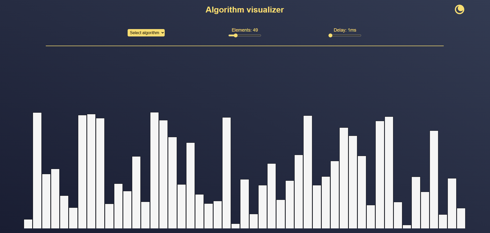

# Algorithm visualizer

Algorithm visualizer is an Angular based web-application to learn about different sorting algorithms visually.
This is a group project for the computer science classes at the DHBW.

# What can it do?

- Visualize sorting algorithms
   - Bubble sort
   - Heap sort
   - Insertion sort
   - Merge sort
   - Quick sort
   - Selection sort
   - Shell sort
- Change the speed of visualization
- Select the amount of elements to be sorted
- Count the amount of swaps and comparisons
- Change theme
- Save changed settings

# Developer information

**Download the following software:**
- [Git](https://git-scm.com/downloads)
  - For further contribution, setup [GitHub SSH Authentication](https://docs.github.com/en/authentication/connecting-to-github-with-ssh/generating-a-new-ssh-key-and-adding-it-to-the-ssh-agent) and [create a fork](https://github.com/vKekz/Algorithm-Visualizer/fork)
- [NodeJS](https://nodejs.org/download/release/latest/)
- IDE (e.g. Visual Studio Code)

**Build the project:**
1. Install the [Angular-CLI](https://angular.dev/tools/cli/setup-local#install-the-angular-cli) & Prettier (executed in terminal)
    - `npm install -g @angular/cli`
    - `npm install -g prettier` (used as a formatter)
    - `Set-ExecutionPolicy -Scope CurrentUser -ExecutionPolicy RemoteSigned` (Optional: If errors occur when running the web-app)
2. Clone the project to a selected location
    - `git clone https://github.com/vKekz/Algorithm-Visualizer.git`
3. Navigate to the `algorithm-visualizer` sub-folder
   - `cd algorithm-visualizer`
4. Install dependencies
   - `npm install`
5. Run web-application
   - `ng serve --open` (optional: --open, opens the browser)

**[!]** Commands 3-5 are executed from a terminal in the selected cloned location